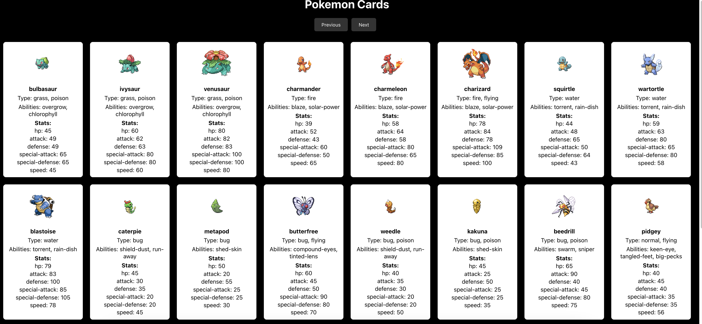

# PokemonApp

Fetch Data from pokemon open api. 

## How to Run

1. Clone this repository to your local machine: `https://github.com/OrghoDeb/PokemonApp.git`
2. Navigate to the project directory: `cd PokemonApp/`
3. Install dependencies: `npm i`
4.  Start the development server: `npm start`

## Copyright

Owned by Bhaskar Deb

## Tech information 

| Tech  | Version |
| ----- | ------- |
| React | 18.2.0  |

### License

This project is licensed under the MIT License